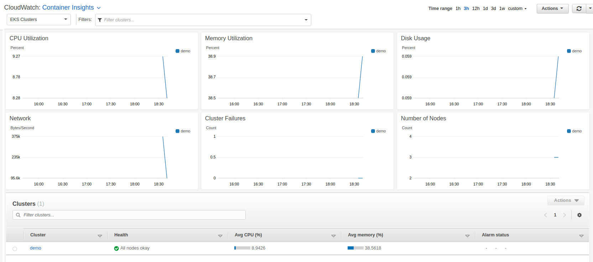

# Overview

## Components 

Each component is contained in a dedicated sub-folder in the present repo. 

Each component:
1. Has a `Dockerfile`
1. Is deployed to docker-hub
1. Has a k8s deployment in the `/udacity-c3-deployment/k8s-deployments` folder
1. Has a corresponding k8s service in the `/udacity-c3-deployment/k8s-services` folder
1. Has been deployed to kubernetes live cluster

For local testing; 
1. Scripts for testing straight typescript code are found in the root directory, for example `run-feed-service-local-dev.sh`. 
1. Scripts for testing the created docker images are found, for example `run-feed-service-docker.sh`. 
1. A script for running all containers is also created; `run-docker-compose-up.sh`. 

These scripts depend on the `.env` file, which is not deployed to GitHub for security reasons. 

### feed-service
/udacity-c3-restapi-feed

### user-service
/udacity-c3-restapi-user

### reverseproxy
/udacity-c3-restapi-reverseproxy

### frontend
/udacity-c3-frontend


## Secret and configuration management

### Local secrets 
A `.env` file is executed to load environments. The .aws folder is mounted. 

### Kubernetes secrets 

`aws-secret.yaml` and `.env-secret.yaml` are git-ignored for security. They contain; 

| Environment Variables     |
|---------------------------|
| POSTGRES_USERNAME         |
| POSTGRES_PASSWORD         |
| POSTGRES_DATABASE         |
| POSTGRES_HOST             |
| POSTGRES_AWS_REGION       |
| POSTGRES_AWS_PROFILE      |
| POSTGRES_AWS_MEDIA_BUCKET |
| JWT_SECRET                |

AWS credentials are passed in as a secret, using `$HOME/.aws_udacity:/root/.aws`. 

Confirmed deployment: 
```
> k get secrets
NAME                  TYPE                                  DATA   AGE
aws-secret            Opaque                                2      45m
default-token-7zmv7   kubernetes.io/service-account-token   3      24h
env-secret            Opaque                                8      45m
```

### k8s configmaps

| Environment Variables |
|-----------------------|
| URL                   |

Confirmed: 
```
NAME         DATA   AGE
env-config   1      46m
```


## Criteria completion

### Criteria section: CI/DC, Github & Code Quality

---

> The project demonstrates an understanding of CI and Github. All project code is stored in a GitHub repository and a link to the repository has been provided for reviewers. The student uses a CI tool to build the application.

Travis file included in root of project. 

Travis builds: https://travis-ci.org/MarcusJones/udacity_cloud_dev


---

>The project has a proper documentation. The README file includes introduction how to setup and deploy the project. It explains the main building blocks and has comments in the important files.

(See above overview section)

---

> The project use continuous deployments (CD). A CD tool is in place to deploy new version of the app automatically to production. The way is described and easy to follow.

Travis builds: https://travis-ci.org/MarcusJones/udacity_cloud_dev

Travis.yml includes k8s and docker. 


### Criteria section: Container

> The app is containerized. There is a Dockerfile in repo and the docker image can be build. 

Dockerfile exists in each component folder. 

Docker testing matrix: 

| component    | port | npm run dev | npm run prod |
|--------------|------|-------------|--------------|
| feed-service | 8080 | OK          | OK           |
| user-service | 8080 | OK          | OK           |
| frontend     | 8100 | OK          | N/A          |
| reverseproxy | 8080 | N/A         | N/A          |

---

> The project have public docker images. On DockerHub images for the application are available.


Docker hub links: 

| component    | Dockerized                                                                                                            |
|--------------|-----------------------------------------------------------------------------------------------------------------------|
| feed-service | [udacity-c3-feed-service](https://cloud.docker.com/u/plasmafrog/repository/docker/plasmafrog/udacity-c3-feed-service) |
| user-service | [udacity-c3-user-service](https://cloud.docker.com/u/plasmafrog/repository/docker/plasmafrog/dacity-c3-user-service)  |
| frontend     | [udacity-frontend](https://hub.docker.com/r/plasmafrog/udacity-frontend)                                              |
| reverseproxy | [reverseproxy](https://hub.docker.com/r/plasmafrog/reverseproxy)                                                      |

---

> The applications runs in a container without errors. Starting the app as a container on a local system. 

Shell scripts are provided for each component, as well as a master docker-compose shell script. Environment variables are loaded by a `.env` script (not pushed to Github for security reasons). 

---

### Criteria section: Deployment

---

> The application runs on a cluster in the cloud. The project can be deployed to a kubernetes cluster. 

Kubernetes status, using `kubectl get all`:
```
NAME                                READY   STATUS    RESTARTS   AGE
pod/backend-feed-77b6d6b8b-kj77z    1/1     Running   0          164m
pod/backend-feed-77b6d6b8b-qjrvf    1/1     Running   0          164m
pod/backend-feed-77b6d6b8b-xq6ww    1/1     Running   0          164m
pod/backend-user-b9f59c86b-j88xm    1/1     Running   0          160m
pod/backend-user-b9f59c86b-v7pjf    1/1     Running   0          160m
pod/frontend-64ffbd5967-7hfdb       1/1     Running   0          140m
pod/frontend-64ffbd5967-fmnzg       1/1     Running   0          140m
pod/pod-example                     1/1     Running   244        23h
pod/reverseproxy-696f9f9b4f-c9cgq   1/1     Running   244        23h
pod/reverseproxy-696f9f9b4f-vf225   1/1     Running   245        23h

NAME                   TYPE        CLUSTER-IP       EXTERNAL-IP   PORT(S)    AGE
service/backend-feed   ClusterIP   10.97.140.226    <none>        8080/TCP   145m
service/backend-user   ClusterIP   10.97.91.167     <none>        8080/TCP   145m
service/frontend       ClusterIP   10.106.197.183   <none>        8100/TCP   145m
service/kubernetes     ClusterIP   10.96.0.1        <none>        443/TCP    26h
service/reverseproxy   ClusterIP   10.103.216.162   <none>        8080/TCP   144m

NAME                           READY   UP-TO-DATE   AVAILABLE   AGE
deployment.apps/backend-feed   3/3     3            3           164m
deployment.apps/backend-user   2/2     2            2           160m
deployment.apps/frontend       2/2     2            2           140m
deployment.apps/reverseproxy   2/2     2            2           23h

NAME                                      DESIRED   CURRENT   READY   AGE
replicaset.apps/backend-feed-77b6d6b8b    3         3         3       164m
replicaset.apps/backend-user-b9f59c86b    2         2         2       160m
replicaset.apps/frontend-64ffbd5967       2         2         2       140m
replicaset.apps/reverseproxy-696f9f9b4f   2         2         2       23h
```

---

> The app can be upgraded via rolling-update. The students can deploy a new version of the application without downtime. 

Kubernetes cluster supports rolling-update. 

---

> A/B deployment of the application. Two versions of the 
same app can run at the same and service traffic. 

Kubernetes cluster supports A/B testing by changing each pod seperately. 

---

 > Monitoring. The application is monitored by Amazon CloudWatch.

 Cloud watch has been deployed to the cluster, below the pods: 

 ```
 NAME                     READY   STATUS    RESTARTS   AGE
cloudwatch-agent-blcsz   1/1     Running   0          7s
cloudwatch-agent-p42f2   1/1     Running   0          7s
cloudwatch-agent-tzqb2   0/1     Pending   0          7s
```

Running cloudwatch: 

